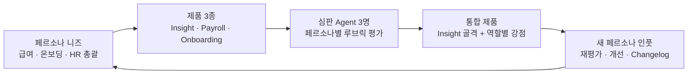

<div align="center">


### 매일 반복되는 HR 운영을, Agent가 수행하는 회사.

**Zero Company OS**의 첫 번째 제품 · **Everyday People Agent**

[통합 서비스 열기](https://zero-hr-six.vercel.app/) · [프로젝트 가이드](zero-hr/README.md) · [제품 채택 근거](https://zero-hr-six.vercel.app/decision) · [변경 이력](zero-hr/products/CHANGELOG.md)

`Claude Fable 5.1 Build Day`　`Everyday`　`2026.09.23`　`Synthetic HR Data`

</div>

---

## 작은 팀도 완전한 회사를 운영할 수 있을까?

회사는 작아도 HR·재무·법무·고객지원은 필요합니다. 도구를 도입해도 데이터를 모으고, 숫자를 맞추고, 결과를 전달하는 일은 사람에게 남습니다.

**Zero Company는 Agent가 반복 운영을 수행하고, 사람이 미션·판단·관계를 담당하는 회사 운영체제입니다.** 첫 적용 사례인 HR 제품은 인원현황·정원·입퇴사 예정 자료를 받아 클린징, 통계, 월말 예측, 대시보드와 리포트 생성까지 연결합니다.

> 이번 Build Day의 테마는 **Everyday**. 매월 반복되는 인사 리포팅을 재현 가능한 업무 흐름으로 만드는 데 집중했습니다.

## 하나의 업무공간에서

| 화면 | 답하는 질문 | 바로 보기 |
|---|---|---|
| **통합 워크스페이스** | 오늘 무엇을 확인하고 처리해야 할까? | [서비스 열기 ↗](https://zero-hr-six.vercel.app/) |
| **Insight** | 지금 몇 명이고, 월말에는 어디가 부족할까? | [인원 분석 ↗](https://zero-hr-six.vercel.app/#insight) |
| **Payroll Close** | 이번 급여 마감에서 확인할 입퇴사·휴직·계약 이슈는? | [급여 마감 ↗](https://zero-hr-six.vercel.app/#payroll) |
| **Onboarding** | 누가 언제 들어오고, 무엇을 준비해야 할까? | [온보딩 ↗](https://zero-hr-six.vercel.app/#onboarding) |
| **월초 리포트** | 경영진과 공유할 결론은 무엇일까? | [리포트 ↗](https://zero-hr-six.vercel.app/#report) |
| **채택 근거** | 세 제품 중 왜 이 구성을 선택했을까? | [평가 과정 ↗](https://zero-hr-six.vercel.app/decision) |

[Before 사이트 보기](https://claude.ai/code/artifact/7e13938a-4161-4a07-b4be-d010dc6f33cb) — 비교용 기존 화면이며 Claude 로그인이 필요할 수 있습니다.

## 숫자로 보는 데모

가상 고객사 **㈜온다테크** · 기준일 **2026-09-23** · **11개 조직**

| 현재 재직 | 휴직 | 총 정원(TO) | 월내 입사 예정 | 월내 퇴사 예정 | 월말 예측 | 월말 정원 차이 |
|:---:|:---:|:---:|:---:|:---:|:---:|:---:|
| **406** | **21** | **422** | **+19** | **−14** | **411** | **−11** |

```text
406명 현재 재직 + 19명 입사 예정 − 14명 퇴사 예정 = 411명 월말 예측
411명 월말 예측 − 422명 정원 = 11명 부족
```

- **Engineering −7 / Sales −4:** 채용 파이프라인 점검과 채용 가속 검토.
- **Data & AI +7:** 정원 재검토와 내부 이동배치 검토.
- 채용·이동 등 실제 인사 판단은 사람이 담당합니다.

## 세 제품을 만들고, 평가하고, 하나로



| 제품 | 담당 페르소나 | 가중 기준 충족률 | 패널 점수 / 10 | 종합 점수 / 10 |
|---|---|---:|---:|---:|
| **Insight** | 인사 총괄 | 100% | 5.23 | **7.62** |
| Onboarding | 온보딩 담당 | 100% | 3.80 | 6.90 |
| Payroll Close | 급여 담당 | 100% | 3.70 | 6.85 |

종합 점수 = `0.5 × 가중 기준 충족률 × 10 + 0.5 × 패널 점수`. Agent 평가 결과이며 사용자 만족도 실측치는 아닙니다. [루브릭·평가 원본](zero-hr/products/product-comparison.json)

## Agent가 함께 일하는 방식

| Zero Company Rule | 구현 방식 |
|---|---|
| **명확한 역할** | 수집·클린징·분석·예측·제품·평가·검증 Agent의 책임과 산출물 정의 |
| **발견과 실패 공유** | 시도·근거·실패·검증·인계점의 5개 절로 실행 로그 기록 |
| **하네스로 업무 분할** | Skills와 결정적 Python 스크립트를 연결하고 owner가 조율 |
| **사람의 승인** | 외부 발송·인사 결정·조직 변경 등은 승인 경계로 분리 |
| **재사용 가능한 결과** | CSV / JSON / HTML / Markdown / Function Call 도구로 보존 |

[회사 운영체제](zero-hr/zero-company/ZERO_COMPANY_OS.md) · [데이터 계약](zero-hr/.claude/DATA_CONTRACT.md) · [실행 인계 로그](zero-hr/_workspace/handoff/)

## 직접 실행하기

**Python 3.9 이상**, 표준 라이브러리만 사용합니다. 이미 생성된 데모는 바로 열 수 있습니다.

```bash
git clone https://github.com/kep-yang-mi/yang_team.git
cd yang_team/zero-hr
python3 -m http.server 8080 --bind 127.0.0.1 --directory site
```

[로컬 데모 열기](http://127.0.0.1:8080/) · 원천부터 재생성하려면 [상세 실행 가이드](zero-hr/README.md#원천부터-다시-만들기)를 참고하세요.

```bash
# zero-hr 폴더에서 검증
python3 -m unittest discover -s tests -v
```

## 구현 범위와 다음 단계

| 구현·검증된 것 | 다음 단계 |
|---|---|
| 가상 원천 생성 → 클린징 → 통계·예측 → 화면·리포트 생성 | 실제 HRIS / ATS / Google Sheets 연결 |
| 결함 127건, 원천·정제 13개 파일의 재생성 결정성 검사 | 고객사별 데이터 계약과 변경 관리 |
| 공통 메뉴를 갖춘 통합 사이트, 역할별 표시, Function Call 도구 18개 | 운영 인증·인가와 tenant 격리 |
| 월초 리포트·발송 명세 생성 | 스케줄러·메일 발송 서비스 연결 |

**모든 HR 데이터는 가상 자료입니다.** 공개 사이트는 생성된 스냅샷을 보여주며, 역할 선택은 표시 필터입니다. 실시간 HRIS 연동·운영 접근 통제·실제 메일 발송을 구현한 것으로 해석하지 않습니다. **리소스 80% 절감은 목표이며 검증된 운영 성과가 아닙니다.**

---

<div align="center">

**Agent가 운영하고, 사람이 방향을 결정합니다.**

[데모 체험](https://zero-hr-six.vercel.app/) · [코드·실행 가이드](zero-hr/) · [Zero Company의 시작](zero-hr/zero-company/zero_company_external_brief.md)

</div>
