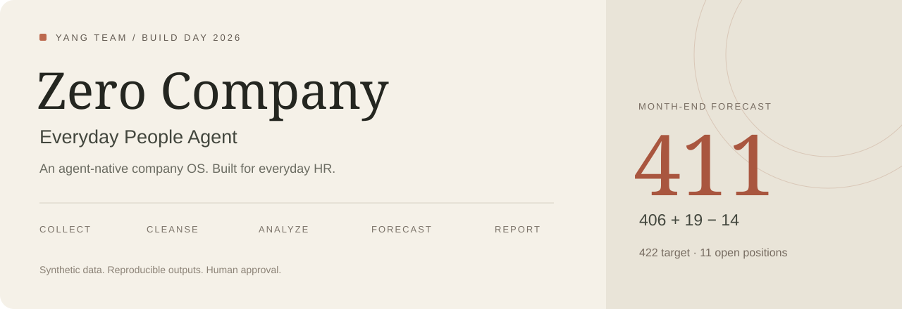
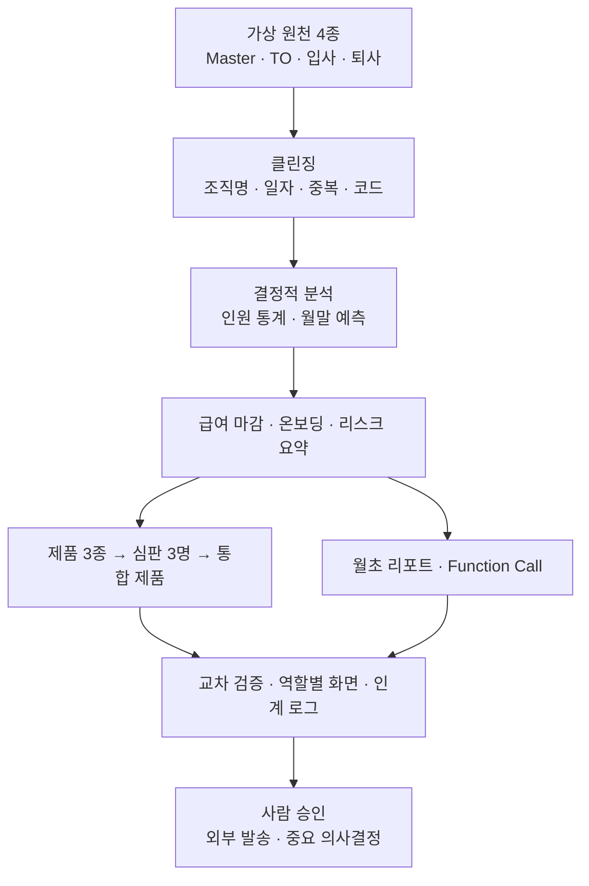

<div align="center">



### HR 운영을 수행하는 Agent, 결과를 검증할 수 있는 하네스.

[통합 데모](https://zero-hr-six.vercel.app/) · [프로젝트 소개](../README.md) · [제품 채택 근거](https://zero-hr-six.vercel.app/decision) · [변경 이력](products/CHANGELOG.md)

</div>

## 이 프로젝트가 하는 일

**Everyday People Agent**는 Zero Company OS 위에 만든 HR 운영 데모입니다. Agent가 만든 가상 원천을 수집·정제하고, 결정적 스크립트가 인원 통계와 월말 예측을 계산합니다. 결과는 하나의 사이트, 역할별 제품 화면, 월초 리포트와 Function Call 인터페이스로 제공합니다.

기준일은 **2026-09-23**입니다. 가상 고객사 **㈜온다테크**의 11개 조직, 총원 427명(재직 406명 + 휴직 21명)을 다룹니다.

## 화면 둘러보기

| 경로 | 화면 |
|---|---|
| [`/`](https://zero-hr-six.vercel.app/) | 통합 워크스페이스 — 공통 메뉴로 기능 이동 |
| [`/app`](https://zero-hr-six.vercel.app/app) | 6개 역할을 반영한 통합 제품 |
| [`/insight`](https://zero-hr-six.vercel.app/insight?view=executive) | 인원현황·속성 통계·정원 차이·월말 예측 |
| [`/payroll`](https://zero-hr-six.vercel.app/payroll) | 급여 마감 점검·입퇴사·휴직·계약 만료 |
| [`/onboard`](https://zero-hr-six.vercel.app/onboard) | 입사 타임라인·조직 배치·체크리스트 |
| [`/decision`](https://zero-hr-six.vercel.app/decision) | 페르소나별 루브릭과 제품 채택 근거 |
| [`/reports/monthly-report-2026-10.html`](https://zero-hr-six.vercel.app/reports/monthly-report-2026-10.html) | 월초 리포트 |
| [`/api/index.json`](https://zero-hr-six.vercel.app/api/index.json) | 정적 Function Call 카탈로그 |

[Before 사이트](https://claude.ai/code/artifact/7e13938a-4161-4a07-b4be-d010dc6f33cb)는 비교용 기존 화면입니다. Claude 로그인이 필요할 수 있습니다.

## 실행 구조



Agent는 역할별 Skills로 업무를 조율하고, 수치 계산은 Python으로 재현합니다. 생성기 시드는 `20260923`으로 고정되어 있습니다. 기존 원천을 복사하지 않고 새 폴더에서 생성해도 원천·정제 파일 **13개가 바이트 단위로 일치**하는지 검사합니다.

## 1분 안에 화면 실행

Python 3.9 이상이 필요하며 별도 Python 패키지는 없습니다.

```bash
git clone https://github.com/kep-yang-mi/yang_team.git
cd yang_team/zero-hr
python3 -m http.server 8080 --bind 127.0.0.1 --directory site
```

[로컬 통합 사이트 열기](http://127.0.0.1:8080/). 종료는 `Ctrl+C`입니다.

## 원천부터 다시 만들기

아래 명령은 이 프로젝트의 가상 원천·파생 산출물을 다시 생성합니다. `zero-hr` 폴더에서 실행하세요.

```bash
set -e
HR_ROOT="$PWD"
HR_AS_OF=2026-09-23

python3 .claude/skills/people-data-integration/scripts/generate_synthetic_sources.py --root "$HR_ROOT" --as-of "$HR_AS_OF" --self-check
python3 .claude/skills/people-data-cleansing/scripts/cleanse.py --root "$HR_ROOT" --as-of "$HR_AS_OF"
python3 .claude/skills/headcount-stats/scripts/compute_stats.py --root "$HR_ROOT" --as-of "$HR_AS_OF"
python3 .claude/skills/attrition-risk/scripts/score_attrition.py --root "$HR_ROOT" --as-of "$HR_AS_OF"
python3 .claude/skills/month-end-forecast/scripts/forecast.py --root "$HR_ROOT" --as-of "$HR_AS_OF" --self-check
python3 .claude/skills/payroll-close/scripts/payroll_close.py --root "$HR_ROOT" --as-of "$HR_AS_OF"
python3 .claude/skills/onboarding-plan/scripts/onboarding_plan.py --root "$HR_ROOT" --as-of "$HR_AS_OF"
python3 .claude/skills/monthly-report/scripts/automation_effect.py --root "$HR_ROOT" --as-of "$HR_AS_OF"
python3 .claude/skills/monthly-report/scripts/render_report.py --root "$HR_ROOT" --as-of "$HR_AS_OF"
python3 .claude/skills/product-build/scripts/build_snapshots.py --root "$HR_ROOT" --as-of "$HR_AS_OF" --product all --embed
python3 api/build_static.py --root "$HR_ROOT"
python3 scripts/build_workspace.py
python3 -m unittest discover -s tests -v
```

제품의 페르소나 평가·디자인 자체를 다시 만드는 절차는 [zerohr-orchestrator](.claude/skills/zerohr-orchestrator/SKILL.md)를 따릅니다. 위 명령은 기존 제품 구조에 데이터를 다시 생성·반영하는 경로입니다.

원천 변경 없이 검증만 하려면:

```bash
python3 .claude/skills/people-data-integration/scripts/generate_synthetic_sources.py \
  --root "$PWD" --as-of 2026-09-23 --check-only
```

`--no-bom`은 BOM 없는 UTF-8 CSV를 생성합니다. 기본 UTF-8 BOM 출력이 기존 기준 파일과 일치합니다. 다른 기준일의 실데이터를 사용하려면 고객사 데이터 계약·스키마·기준일과 검증 기준을 함께 조정해야 합니다.

## 무엇을 검증하는가

| 검증 영역 | 확인 사항 |
|---|---|
| 데이터 계약 | 헤더, 도메인, 행 수, 조직 매핑, 파생 필드 |
| 클린징 | 주입 결함 127건과 로그 대사, 중복 제거 8건, 미해결 12건 |
| 결정성 | 빈 폴더에서 원천 생성 → 클린징 → 기존 13개 파일과 SHA-256 비교 |
| 재생성 복구 | 단독 스크립트 실행, read-only 검증, 훼손 자료 탐지, BOM 옵션, 오류 반환 |
| 교차 대사 | 통계·예측·급여·온보딩·화면·API의 공통 수치 |
| 사이트 | 통합 메뉴, 역할별 표시, 내장 JSON, 개인정보 필드 범위 |

```bash
python3 -m unittest discover -s tests -v
```

HTTP API 검증에는 로컬 서버 포트 사용이 필요합니다. 인증·tenant 격리 등 운영 보안을 검증하는 테스트 모음은 아닙니다.

## 데모 데이터와 핵심 지표

| 원천 | 실제 원천 행 수 | 분석 기준 |
|---|---:|---|
| 인원현황 Master | 435 | 중복 8행 제거 → 총원 427명 |
| TO 관리 | 11 | 11개 조직 정원 합계 422명 |
| 입사 예정 | 27 | 당월 19명 + 다음 달 8명 |
| 퇴사 예정 | 19 | 당월 유효 14명 + 다음 달 4명 + 미확인 사번 1명 |

**월말 예측 411 = 현재 재직 406 + 입사 19 − 퇴사 14**

**월말 정원 차이 −11 = 예측 411 − 정원 422**

| 조직 | 정원 | 재직 | 입사 | 퇴사 | 월말 예측 | 월말 차이 |
|---|---:|---:|---:|---:|---:|---:|
| CEO Office | 10 | 10 | 0 | 0 | 10 | 0 |
| Product | 54 | 51 | 3 | 1 | 53 | −1 |
| Engineering | 112 | 104 | 5 | 4 | 105 | **−7** |
| Design | 26 | 25 | 1 | 1 | 25 | −1 |
| Data & AI | 34 | 40 | 2 | 1 | 41 | **+7** |
| Sales | 62 | 58 | 3 | 3 | 58 | **−4** |
| Marketing | 32 | 30 | 1 | 1 | 30 | −2 |
| Customer Success | 42 | 40 | 2 | 1 | 41 | −1 |
| People | 18 | 18 | 1 | 0 | 19 | +1 |
| Finance | 20 | 19 | 1 | 1 | 19 | −1 |
| Legal & Compliance | 12 | 11 | 0 | 1 | 10 | −2 |
| **합계** | **422** | **406** | **19** | **14** | **411** | **−11** |

조직표를 합산한 그룹별 재직은 **Executive 10 / Build 220 / Go-To-Market 128 / Operations 48**입니다. 최초 브리프의 그룹 수치와 차이가 있어 조직표를 정본으로 채택했으며, [결정 기록 DR-002](zero-company/DR-002-org-chart-over-brief-groups.md)에 근거를 남겼습니다.

## Function Call 인터페이스

급여·온보딩·HR 시스템의 Agent가 사용할 **18개 도구**를 제공합니다. 카탈로그, 로컬 HTTP 서버, MCP stdio 서버, 정적 조회 결과로 구성됩니다.

```bash
# zero-hr 폴더에서 실행
python3 api/server.py --root "$PWD" --port 8787

# 별도 터미널에서 호출
curl -s http://127.0.0.1:8787/call \
  -H 'Content-Type: application/json' \
  -d '{"name":"insight.get_executive_snapshot","arguments":{"role":"executive"}}'

# MCP stdio 실행
python3 api/mcp_server.py
```

| 도구 영역 | 담당 업무 |
|---|---|
| `payroll.*` | 마감 점검·일할·휴직·계약 만료·위험 |
| `onboarding.*` | 타임라인·조직 배치·체크리스트·코호트 |
| `insight.*` | 스냅샷·예측·인사이트·속성·리스크·품질·시나리오 |
| `report.get_monthly_dispatch` | 월초 리포트 발송 명세 조회 |
| `approval.request` | 승인 대기 기록 생성 |

정적 Vercel 사이트의 `/api/*.json`은 읽기 전용 스냅샷이며, 위 Python HTTP 서버가 배포된 엔드포인트는 아닙니다. 요청의 `role`은 데모용 필터이고 실제 사용자 인증·인가를 대신하지 않습니다. [MCP 설정 예시](api/mcp.example.json)

## 제품이 진화하는 방법

1. [페르소나 니즈](personas/persona-needs.json)를 구조화합니다.
2. Insight / Payroll Close / Onboarding을 각각 만듭니다.
3. 심판 Agent 3명이 각 페르소나의 루브릭으로 모든 제품을 평가합니다.
4. [평가 결과](products/product-comparison.json)에 따라 Insight 골격에 역할별 강점을 통합합니다.
5. [새 인풋](products/inputs/) → 재평가 → 재빌드 → [Changelog](products/CHANGELOG.md)로 이어갑니다.

## 저장소 구조

```text
zero-hr/
├── .claude/          # 데이터 계약 · 역할 Agent · Skills · 정책
├── zero-company/     # 회사 미션 · 운영 규칙 · 결정 기록
├── data/             # raw → clean → stats / reference
├── personas/         # 페르소나 니즈
├── products/         # 제품 비교 · 새 인풋 · Changelog
├── scripts/          # 통합 워크스페이스 생성
├── site/             # 공개 정적 사이트
├── api/              # 도구 카탈로그 · HTTP · MCP
├── reports/          # 월초 리포트 · CSV · 발송 명세
├── supabase/         # 적재·검증 구성
├── tests/            # 계약 · 결정성 · 대사 · API · 사이트 검증
└── _workspace/       # 실행 근거 · 심판 평가 · 인계 로그
```

## 기술 구성과 범위

- **업무 조율:** 역할 Agent, Skills, `zerohr-orchestrator`.
- **계산·검증:** Python 3.9+ 표준 라이브러리, `unittest`.
- **화면:** HTML / CSS / JavaScript, 정적 JSON 스냅샷.
- **형상·배포:** GitHub, Vercel. Supabase 적재·검증 구성은 `supabase/`에 있습니다.
- **디자인:** 따뜻한 중성 배경과 절제된 타이포그래피. Anthropic 스타일에서 영감을 받은 데모이며 공식 제품은 아닙니다.

<details>
<summary><strong>현재 구현과 목표의 경계</strong></summary>

- 모든 HR 데이터는 가상입니다. 실데이터를 공개 사이트에 올리는 구성으로 사용하지 않습니다.
- 공개 화면은 생성 시점의 스냅샷입니다. HRIS 실시간 연동은 후속 과제입니다.
- 화면 역할 선택은 표시 필터입니다. 운영용 인증·인가·row-level security는 별도 구현이 필요합니다.
- 월초 리포트와 메일 명세는 `ready-to-send` 상태입니다. 스케줄 발송은 연결되어 있지 않습니다.
- 급여 화면은 마감 점검 데모입니다. 실급여액 계산·지급 기능을 제공하지 않습니다.
- 이직 리스크와 인력 권고는 데모 분석이며 실제 채용·해고·이동 결정을 자동 실행하지 않습니다.
- ‘리소스 80% 절감’은 성공 목표입니다. 실제 고객 운영에서 검증된 성과가 아닙니다.

</details>

---

**Build Day · Everyday · 2026-09-23**

반복 업무는 Agent에게, 방향과 판단은 사람에게.
